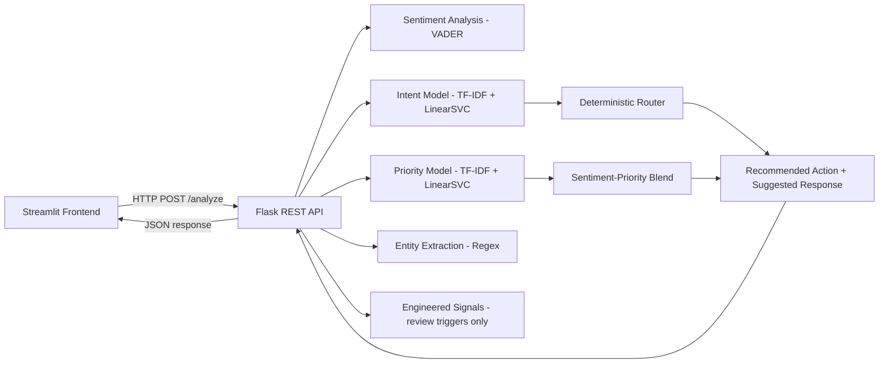

# MailFlow AI — Intelligent Email Classification & Routing System

A lightweight, end-to-end AI/ML system that analyzes incoming support emails and automatically determines intent, priority, sentiment, department routing, key entities, a recommended action, and a draft response — built to assist human operators, not replace them. **The system never sends email automatically.**

**🔗 Live application:** [https://mailflow-ai.onrender.com](https://mailflow-ai.onrender.com)

---

## Overview

Support teams receive large volumes of email that must be read, categorized, prioritized, and routed before anyone can act on them. Doing this by hand does not scale and produces inconsistent triage. MailFlow automated that first triage pass: every incoming email is classified, scored, and routed in under a second, with low-confidence or low-information predictions explictily flagged for human review rather than silently trusted.

The project intentionally stays lightweight — classical ML (TF-IDF + linear models) instead of transformers, a deterministic rules layer wherever a rule is more honest than a model, and a single Docker image that deploys to Render with an automated CI/CD.

## Features

- **Intent classification** — Billing / Technical Support / Sales / General Inquiry
- **Priority prediction** — LOW / MEDIUM / HIGH, blended with a transparent, bounded sentiment-based adjustment
- **Sentiment analysis** — lexicon-based (VADER), no transformer, loads instantly
- **Deterministic department routing** — explainable dict lookup, not a model
- **Entity extraction** — regex-based (order ID, invoice ID, ticket ID, amount, email, date); returns `null` rather than guessing
- **Recommended action** — template-based, driven by intent + priority
- **Suggested response** — editable draft in the UI, clearly labeled as a suggestion, never auto-sent
- **Confidence- and information-aware human review flag** — a prediction is flagged for review if the model is unsure _or_ the input itself was too thin to trust (e.g. missing subject, near-empty body) — see `review_reason` in the API response

## Tech Stack

| Layer             | Choice                                                              |
| ----------------- | ------------------------------------------------------------------- |
| Backend           | Python, Flask, Gunicorn                                             |
| Frontend          | Streamlit                                                           |
| ML                | scikit-learn (TF-IDF, LogisticRegression, LinearSVC, MultinomialNB) |
| Data              | pandas, NumPy                                                       |
| Model persistence | joblib                                                              |
| Sentiment         | vaderSentiment                                                      |
| Config            | python-dotenv                                                       |
| Testing           | pytest                                                              |
| Containerization  | Docker                                                              |
| CI/CD             | GitHub Actions                                                      |
| Deployment        | Render (Docekr Web Service)                                         |

Deliberately excluded, per the lightweight-deployment constraint: PyTorch, TensorFlow, transformer models, ChromaDB/FAISS, Redis/Celery/Kafka,
Kubernetes, React/Next.js.

## Architecture



**Deployment:** a single Docker container running two independent processes, started once by `docker/entrypoint.sh`:

```
Docker container
│
├── Gunicorn (background)
│     └── Flask API — 127.0.0.1:5000 (internal only, never exposed)
│
└── Streamlit (foreground, public)
      └── 0.0.0.0:${PORT} (Render injects this at runtime; defaults to 7860 locally)
            │
            └── HTTP → 127.0.0.1:5000
```

Gunicorn starts Flask **exactly once per container**, entirely
independent of Streamlit or any user session. The entrypoint script
waits for Flask to report healthy before starting Streamlit, so
Streamlit never races the backend's startup. Only Streamlit's port is
exposed — Flask is reachable solely via the container-internal loopback
address, so it is never publicly accessible on its own. Locally, the two
processes run as separate terminal commands (see Section 12); the
frontend only ever talks to the backend over HTTP, never by importing
its internals.

> **Note on an earlier design:** a prior version started Flask from
> inside Streamlit using a background thread gated by
> `st.session_state`. That was incorrect for multi-user deployment —
> `st.session_state` is scoped per browser session, not process-wide, so
> concurrent users could each attempt to bind Flask's dev server to the
> same port. The current architecture (Gunicorn + Streamlit as two
> processes, started once by the container entrypoint) fixes this.

## Project Structure

```
mailflow/
├── app/
│   ├── __init__.py                             # Flask app factory
│   ├── config.py                               # centralized env-var configuration
│   ├── routes.py                               # GET /health, POST /analyze
│   ├── predictor.py                            # loads models, predicts category + priority
│   ├── sentiment.py                            # VADER sentiment analysis
│   ├── entities.py                             # regex-based entity extraction
│   ├── router.py                               # deterministic category -> department
│   ├── responses.py                            # template-based action + response generation
│   └── features.py                             # engineered signals (review triggers, not ML input)
├── frontend/
│   └── app.py                                  # Streamlit dashboard
├── models/                                     # trained .joblib artifacts + metadata
├── training/
│   ├── prepare_data.py                         # raw CSV -> clean_tickets.csv
│   ├── train_intent.py                         # trains Model A
│   ├── train_priority.py                       # trains Model B
│   ├── error_analysis.md                       # full investigation: taxonomy decisions, tuning log, negative results
│   ├── eval_intent.txt                         # real evaluation output
│   └── eval_priority.txt                       # real evaluation output
├── notebooks/
│   ├── 01_data_cleaning.ipynb                  # exploratory, verifiable data pipeline
│   └── 02_model_training_and_selection.ipynb   # exploratory model comparison
├── data/
│   ├── raw_tickets.csv                         # source dataset
│   └── clean_tickets.csv                       # cleaned, feature-engineered output
├── tests/                                      # pytest suite (56 tests)
├── docker/
│   └── entrypoint.sh                           # single-process HF Spaces launcher
├── Dockerfile
├── render.yaml                                 # Render Blueprint (service config as code)
├── .dockerignore
├── .env.example
├── .gitignore
├── requirements.txt / requirements-dev.txt
├── app.py                                     # Flask entrypoint (local dev: `python app.py`)
└── wsgi.py                                    # Gunicorn entrypoint (production/Docker)
```

## API Design

### `GET /health`

```json
{ "status": "healthy" }
```

### `POST /analyze`

**Request:**

```json
{
  "subject": "Payment deducted but subscription inactive",
  "body": "I was charged $999 yesterday but my subscription is still inactive."
}
```

**Response:**

```json
{
  "category": { "label": "Billing", "confidence": 0.83 },
  "priority": {
    "label": "HIGH",
    "confidence": 0.59,
    "raw_model_label": "HIGH",
    "sentiment_adjusted": false
  },
  "sentiment": "Negative",
  "department": "Finance",
  "department_explanation": "Billing-related emails are routed to Finance for payment/invoice handling.",
  "entities": {
    "order_id": null,
    "invoice_id": null,
    "ticket_id": null,
    "amount": "$999",
    "email_address": null,
    "date": null
  },
  "recommended_action": "Verify the payment/transaction immediately and investigate for duplicate charges...",
  "suggested_response": {
    "subject": "Re: Billing Inquiry",
    "body": "We're sorry for the trouble caused..."
  },
  "requires_human_review": false,
  "review_reason": {
    "low_confidence_category": false,
    "low_confidence_priority": false,
    "low_information_input": false
  }
}
```

**`review_reason`** breaks down _why_ `requires_human_review` is true
(or confirms it isn't) across three independent triggers: low model
confidence on category, low model confidence on priority, or a
low-information input (missing subject / near-empty body, detected via
`app/features.py`). These engineered signals are used only for this
review trigger — never as classifier input (see Section 8).

**Validation:** missing `subject`/`body` → 400 · empty input → 400 ·
malformed JSON → 400 · wrong field types → 400 · input exceeding
`MAX_EMAIL_LENGTH` (default 20,000 chars) → 400 · unexpected internal
errors → 500 with no internals leaked to the client.

### ML Pipeline

**Pipeline:** raw CSV → `training/prepare_data.py` (clean, map, engineer
features) → `training/train_intent.py` / `training/train_priority.py`
(TF-IDF → {LogisticRegression, LinearSVC, MultinomialNB} → best model by
macro-F1) → `models/*.joblib`.

### Dataset

**Source:** ["Multilingual Customer Support Tickets"](https://www.kaggle.com/datasets/tobiasbueck/multilingual-customer-support-tickets)
(Tobias Bueck, Kaggle).

**Disclosure:** synthetically generated per its
own documentation, not scraped real-world tickets — used because
genuinely labeled, priority-annotated real-world ticket data isn't
publicly available. 11,923 English rows (German rows dropped) → 11,691
after cleaning.

### Category taxonomy

| Raw `queue`                                                               | → Category                                     |
| ------------------------------------------------------------------------- | ---------------------------------------------- |
| Technical Support, IT Support, Service Outages and Maintenance            | Technical Support                              |
| Billing and Payments                                                      | Billing                                        |
| Sales and Pre-Sales                                                       | Sales                                          |
| Product Support, Customer Service, General Inquiry, Returns and Exchanges | General Inquiry                                |
| Human Resources                                                           | _(dropped — internal, out of scope, 205 rows)_ |

This 4-class scheme replaced an initial 6-class attempt after manual
inspection of misclassified tickets showed the ground-truth labels
themselves were inconsistent across Product Support / Account / General
Inquiry in this synthetic dataset (e.g. clear bug reports labeled
"General Inquiry"). Priority labels (LOW/MEDIUM/HIGH) are the dataset's
real annotations, not rule-derived. Full investigation, including the
actual misclassified examples that drove this decision:
[`training/error_analysis.md`](training/error_analysis.md).

### Data cleaning

- Missing subjects (1,010 rows) tracked via an explicit `subject_missing` flag rather than silently blanked.
- Near-empty bodies (27 rows, <20 characters) excluded from **training only** — confirmed spread thinly across every class first. A real incoming email this thin is still handled at inference time (flagged for review, not rejected).
- Generator placeholder tokens (`<tel_num>`, `<email>`, `<acc_num>`, etc.) stripped via a generic regex, verified to cover every variant present.

### Feature engineering — and a documented negative result

`app/features.py` computes numeric features from subject+body alone
(word/char counts, exclamation count, ALL-CAPS ratio, urgency-keyword
count, missing-subject/low-information-body flags). The dataset's
`tag_1`/`tag_2`/`tag_3` columns were deliberately **excluded** from every
model input — they correlate strongly with category but are annotations
added after human triage; a real incoming email never arrives pre-tagged,
so using them would be data leakage.

Stacking the engineered numeric features alongside TF-IDF was tested for
both models and made Model A _worse_ (category is a topic signal, these
features encode tone) and made no meaningful difference to Model B
(TF-IDF already captures the same urgency words as text tokens). **Not
used as classifier input in production** — a negative result, documented
rather than discarded (full writeup: [`training/error_analysis.md`](training/error_analysis.md)).
They're used instead as human-review trigger signals in the live API
(Section 6).

### Model evaluation (real, measured)

**Model A — Intent Classification (LinearSVC, TF-IDF, 30k features, C=1.5, class_weight=balanced)**

Accuracy: **70%** · Macro-F1: **0.646**

| Category          | Precision | Recall | F1   | Support |
| ----------------- | --------- | ------ | ---- | ------- |
| Billing           | 0.80      | 0.75   | 0.77 | 260     |
| General Inquiry   | 0.67      | 0.67   | 0.67 | 965     |
| Sales             | 0.58      | 0.33   | 0.42 | 66      |
| Technical Support | 0.71      | 0.73   | 0.72 | 1048    |

_Known limitation:_ Sales recall is the weakest metric, driven by sample
size (329 examples total, 66 in test) rather than a labeling or modeling
problem. Kept as its own class since merging it away would eliminate the
sales-routing use case.

**Model B — Priority Classification (LinearSVC, same TF-IDF config)**

Accuracy: **61%** · Macro-F1: **0.593**

| Priority | Precision | Recall | F1   | Support |
| -------- | --------- | ------ | ---- | ------- |
| LOW      | 0.52      | 0.47   | 0.50 | 472     |
| MEDIUM   | 0.61      | 0.65   | 0.63 | 946     |
| HIGH     | 0.66      | 0.65   | 0.65 | 921     |

_Not further tuned, deliberately._ Errors concentrate almost entirely
between _adjacent_ priority levels (LOW↔MEDIUM, MEDIUM↔HIGH) rather than
the two extremes — the signature of an information ceiling: priority is
partly a business judgment call (SLA, customer tier) that text alone
can't fully recover. This is why the deployed system blends the model's
prediction with a bounded, transparently-reported sentiment adjustment
(`app/predictor.py`) instead of chasing a higher score through tuning.

### Confidence handling

LinearSVC has no native `predict_proba`; confidence is a documented
softmax approximation over `decision_function` margins — not a
calibrated probability. Predictions below `CONFIDENCE_THRESHOLD`
(default 0.55) are flagged `requires_human_review: true`.

### Training directory reference

Every file in `training/` is reproducible from the raw dataset and
documents its own reasoning — nothing here is generated once and then
hand-edited:

| File                                              | Description                                                                                                                                                                                                                                  |
| ------------------------------------------------- | -------------------------------------------------------------------------------------------------------------------------------------------------------------------------------------------------------------------------------------------- |
| [`prepare_data.py`](training/prepare_data.py)     | Raw CSV → cleaned, feature-engineered `data/clean_tickets.csv`: language filtering, category taxonomy mapping, missing-subject/near-empty-body handling, engineered feature computation                                                      |
| [`train_intent.py`](training/train_intent.py)     | Trains and compares Model A (LogisticRegression / LinearSVC / MultinomialNB) on TF-IDF text, selects the best by macro-F1, saves `models/intent_model.joblib`                                                                                |
| [`train_priority.py`](training/train_priority.py) | Same process for Model B (priority), saves `models/priority_model.joblib`                                                                                                                                                                    |
| [`eval_intent.txt`](training/eval_intent.txt)     | Real, generated evaluation output for Model A — model comparison, classification report, confusion matrix                                                                                                                                    |
| [`eval_priority.txt`](training/eval_priority.txt) | Same for Model B                                                                                                                                                                                                                             |
| [`error_analysis.md`](training/error_analysis.md) | The full investigation trail: why the category taxonomy was collapsed from 6 to 4 classes (with actual misclassified examples), the hyperparameter tuning log, why Model B wasn't further tuned, and the engineered-features negative result |

### Notebooks

`notebooks/01_data_cleaning.ipynb` and
`notebooks/02_model_training_and_selection.ipynb` mirror the
`training/*.py` scripts exactly, with the full error-analysis
investigation (actual misclassified examples pulled and read, not just
a confusion matrix) and the engineered-features experiment — run these
to verify the pipeline interactively before trusting the scripts.

## Testing

56 pytest tests across 6 files:

| File                | Covers                                                                                                                                                                    |
| ------------------- | ------------------------------------------------------------------------------------------------------------------------------------------------------------------------- |
| `test_api.py`       | health check, valid analysis, missing/empty/malformed/oversized input, response structure, review-trigger behavior                                                        |
| `test_predictor.py` | model loading, prediction structure, confidence bounds, sentiment-boost logic (both trigger and non-trigger cases)                                                        |
| `test_entities.py`  | each entity type, multi-currency amounts, missing-entity nulls (never hallucinated)                                                                                       |
| `test_features.py`  | engineered feature values, and a **regression guard for the NaN-crash bug** (a float `NaN` — e.g. read back from a CSV round-trip — no longer crashes feature extraction) |
| `test_responses.py` | action/response varies correctly by category, priority, and sentiment; unknown-input fallbacks                                                                            |
| `test_router.py`    | every category→department mapping, unknown-category fallback                                                                                                              |

```bash
pip install -r requirements-dev.txt
pytest tests/ -v
```

## User Guide

1. Open the Streamlit app (locally or the deployed HF Space).
2. Enter a **Subject** and **Email body**, or pick a sample email from the sidebar.
3. Click **Analyze Email**.
4. Read the dashboard: intent + confidence, color-coded priority (🔴 HIGH / 🟠 MEDIUM / 🟢 LOW), sentiment, routed department, extracted entities, recommended action.
5. Review the **Suggested Response** — it's pre-filled but fully editable. Copy it into your real email client; the app never sends anything itself.
6. If you see **"⚠️ Human review recommended"**, treat the prediction as a starting point, not a final answer — it means the model was unsure, or the email itself was too thin (e.g. no subject) to classify with confidence.

## Local Development Setup

```bash
git clone <your-repo-url>
cd mailflow
python -m venv venv && source venv/bin/activate   # Windows: venv\Scripts\activate
pip install -r requirements-dev.txt
cp .env.example .env

# Terminal 1 — API
python app.py

# Terminal 2 — frontend
streamlit run frontend/app.py
```

Frontend: http://localhost:8501 · API: http://localhost:5000

### Retraining from scratch

```bash
python training/prepare_data.py    # raw_tickets.csv -> clean_tickets.csv
python training/train_intent.py    # -> models/intent_model.joblib
python training/train_priority.py  # -> models/priority_model.joblib
```

## Configuration

All tunables are environment variables, read via `app/config.py`
(loaded with `python-dotenv`) — no hardcoded magic values. Copy
`.env.example` to `.env` and adjust as needed:

| Variable                                                        | Default                 | Meaning                                                                                                                                                                                                   |
| --------------------------------------------------------------- | ----------------------- | --------------------------------------------------------------------------------------------------------------------------------------------------------------------------------------------------------- |
| `CONFIDENCE_THRESHOLD`                                          | `0.55`                  | Below this, a prediction is flagged `requires_human_review`                                                                                                                                               |
| `MAX_EMAIL_LENGTH` / `MIN_EMAIL_LENGTH`                         | `20000` / `3`           | Combined subject+body length bounds accepted by `/analyze`                                                                                                                                                |
| `SENTIMENT_NEGATIVE_THRESHOLD` / `SENTIMENT_POSITIVE_THRESHOLD` | `-0.05` / `0.05`        | VADER compound-score cutoffs for label bucketing                                                                                                                                                          |
| `NEGATIVE_SENTIMENT_PRIORITY_BOOST_THRESHOLD`                   | `-0.5`                  | Sentiment compound score below this can bump priority up one level                                                                                                                                        |
| `HOST` / `PORT`                                                 | `0.0.0.0` / `5000`      | Flask bind address                                                                                                                                                                                        |
| `DEBUG`                                                         | `false`                 | Flask debug mode                                                                                                                                                                                          |
| `API_URL`                                                       | `http://127.0.0.1:5000` | Frontend's base URL for the backend — correct as-is for both the single-container deployment (Gunicorn on loopback inside the same container) and local development (two terminal processes on localhost) |

No secrets are required — this project has no auth and no external API keys.

## CI/CD

`.github/workflows/ci-cd.yml` runs on every push to `main`:

1. **`test`** — installs dependencies, runs the full pytest suite. Models are pre-trained and committed to `models/`; training does not run in CI (see Section ML pipeline for the retraining workflow if you need to regenerate them).
2. **`build-test-push`** — builds the real `Dockerfile` **once**, tagged with both `:latest` and the short commit SHA. That exact image is smoke-tests (Flask `/health` internally, Streamlit on port 7860 publicly) — only if both pass does the job log int o GHCR (using the workflow's own short-lived `GITHUB_TOKEN`, no secrets needed) and push both tags. Building once and pushin the same artifact that was tested — rather than testing one image and letting the deploy target rebuild independently — guarenteed Render runs exactly what CI verified.
3. **`deploy-to-render`** — only if both above pass, and only on `main`. Triggers Render's [Deploy Hook URL](https://render.com/docs/deploy-hooks) via a simple authenticated `POST`, which tells Render to redeploy by pulling the `:latest` tag just pushed (per `render.yaml`'s `runtime: image` configuration).

Deploying via a CI-triggered hook (rather than relying on Render's own push-based auto-deploy) is deliberate: it makes `test` and `build-test-push` a real **deployment guard** — a broken commit, a failed build, or a failed smoke test never reaches Render, because the hook only fires after every prior job succeeds. `render.yaml` explicitly disables Render's own `autoDeploy` for this reason.

**One-time setup for GHCR:** the first time the workflow pushes an image, GHCR packages are created **private** by default. Go to your GitHub profile/org → Packages → the new `mailflow-ai` (or your repo name) package → Package settings → change visibility to **Public**. This lets Render pull the image without needing a registry credential configured. If you'd rather keep it private, add a registry credential in the Render Dashboard (Workspace Settings) and reference it in `render.yaml` via `image.creds.fromRegistryCreds.name` instead.

## Render Deployment

```bash
docker build -t mailflow-ai .
docker run -p 7860:7860 -e PORT=7860 mailflow-ai
```

Streamlit serves the UI on the port Render assigns via `$PORT` (this project's `docker/entrypoint.sh` already reads `${PORT:-7860}`, so no code change was needed to support Render's dynamic port assignment). Gunicorn runs the Flask API internally on `127.0.0.1:5000`, started before Streamlit boots — it is never exposed outside the container, on any platform.

**One-time setup:**

1. **Create the service** — push `render.yaml` to your repo, then in the Render dashboard: New → Blueprint → connect this repo. Render reads `render.yaml` and provisions an image-based service with auto-deploy already disabled. with auto-deploy already disabled as configured; (A manual "New → Web Service → Existing Image" setup works too, but a Blueprint keeps the config version-controlled)
2. **Get the Deploy Hook URL** — Render dashboard → your service → Settings → Deploy Hook → copy the URL.
3. **Add it as a GitHub secret** (repo Settings → Secrets and variables → Actions): `RENDER_DEPLOY_HOOK_URL`.
4. **Push to `main` once** so the workflow builds and pushes the first image to GHCR, then make that GHCR package public before triggering the first Render deploy.

No `GHCR`-related secret is required — workfloew authenticates with GitHub Actions' own built-in `GITHUN_TOKEN`. After setup, every push to `main` that passes tests, the build, and the smoke test triggers a Render deploy of that exact image. Render's free-tier web services spin down after a period of inactivity and take a little longer to respond to the first request after idling — expected behaviour, not a bug in this project.

## Limitations

- Priority macro-F1 (0.59) reflects a genuine information ceiling — priority is partly a business judgment call, not purely a text-classification problem (Section 7).
- Sales category recall (0.33–0.45, varies slightly across retrains) is limited by sample size (329 rows total, ~66 in test) — small enough that which specific rows land in the test split visibly moves this metric.
- Confidence scores are a documented softmax approximation over SVM decision margins, not calibrated probabilities.
- Underlying dataset is synthetically generated, not organic real-world tickets (disclosed in Section 7).
- Entity extraction is regex-based; it will miss entities in unusual formats it wasn't designed for — by design, it returns `null` rather than guessing.

## Future Improvements

- Confidence calibration (Platt scaling) for more meaningful probability outputs
- Human-feedback logging loop to measure real-world prediction accuracy over time
- A/B testing different response templates
- Expanding Sales training data specifically to address its recall gap
- Optional CSV/analytics export of review-flagged emails for a supervisor queue
